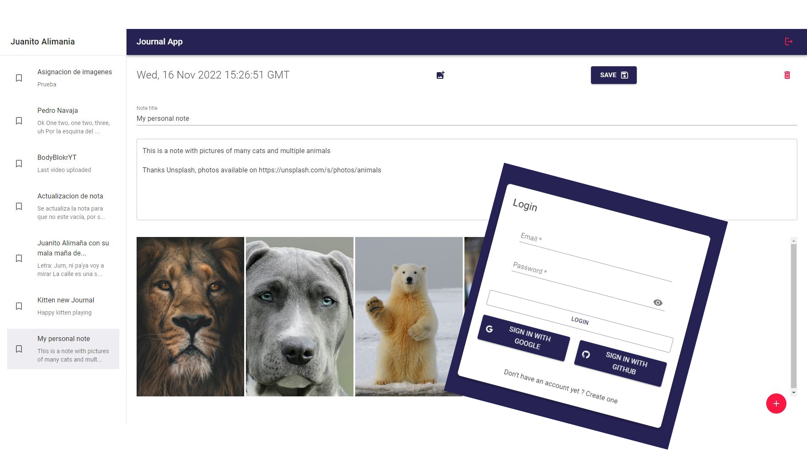

# 📔 Journal App 📔 - Vite  - React 

## Content
* [Description](#description)
* [Project Tech Stack](#project-tech-stack)
* [How to use this project ?](#how-to-use-this-project-)
  * [Development mode](#development-mode)
  * [Testing mode](#testing-mode)
  * [Deployment](#deployment)
* [Dependencies](#dependencies)
* [Available Scripts](#available-scripts)
  * [npm start](#npm-start)
  * [npm test](#npm-test)

## Description

Journal web application for writing down your thoughts or what happened during your day. Create a profile and start creating notes, the app has multiple features like:

- Creating and editing text notes
- Upload one or multiple images to a note
- Showing the list of notes
- Save your notes and open them whenever you want
- Create account using google or github accounts
- Deleting notes

Here is how the web app looks like :

---

Check the deployed site at [Journal App Vite Material](https://reactjs.org/).

---

## Project tech stack

Journal App was made using the library [Reactjs](https://reactjs.org/) for building the user Interface and other utilities like react hooks, [Redux](https://redux.js.org/) and [Redux Toolkit](https://redux-toolkit.js.org/) for the application state management and finally [React Router v6](https://reactrouter.com/) for routes manipulation.

On the other hand for media storage like the notes images, [Cloudinary](https://cloudinary.com/) was the choosen solution. For database was used the [Firestore Database](https://firebase.google.com/docs/firestore) from Firebase and also from Firebase was used [Firebase Authentication](https://firebase.google.com/docs/auth) for user authentication, supporting email, gmail and github authentication.

For devops was used [GitHub Actions](https://github.com/features/actions) for running the app tests every time a commit was pushed to the main branch and ensure all the tests passed. Check the "yml" configuration file at [journalapp.js.yml](.github/workflows/journalapp.js.yml).

Finally for testing the app: [React Testing Library](https://testing-library.com/docs/react-testing-library/intro/) and [Jest](https://jestjs.io/).

## How to use this project ?

You can use this project by three ways:

### Development mode

1. Create a new project on [Firebase console](https://console.firebase.google.com/u/0/) and configure the *Firestore Database* to `write if true` (allow anyone to write) and also configure the *Authentication* sign-in options to "Sign-in with Google", "Sign-in with GitHub", and with "Sign-in with Email and password".
2. Prepare your firebase "app credentials and keys" for the following step. Also create a [Cloudinary](https://cloudinary.com/) account and get your "credentials" to connect the Journal App with Firebase and Cloudinary.
3. Use the template file for *environment variables* in root directory [.env.development.template](.env.development.template) to complete the credentials of firebase and cloudinary. Do not forget to rename it to **.env.development**.
4. Open a command terminal in the project directory and run the command ***npm install*** to install the [main dependencies](#main-dependencies) of the project.
5. Save all and use the [npm start](#npm-start) command in the terminal to start the project.

### Testing mode

Note: If you already have created and configured the Firebase App and the Cloudinary account you can use those same credentials for the Test environment variables, or create a new Firebase App just for testing.

1. Create a new project on [Firebase console](https://console.firebase.google.com/u/0/) and configure the *Firestore Database* to `write if true` (allow anyone to write) and also configure the *Authentication* sign-in options to "Sign-in with Google", "Sign-in with GitHub", and with "Sign-in with Email and password".
2. Prepare your firebase "app credentials and keys" for the following step. Also create a [Cloudinary](https://cloudinary.com/) account and get your "credentials" to connect the Journal App with Firebase and Cloudinary.
3. Use the template file for *test environment variables* in root directory [.env.test.template](.env.test.template) to complete the credentials of firebase and cloudinary. Do not forget to rename it to **.env.test**.
4. Open a command terminal in the project directory and run the command ***npm install --include=dev*** to install both the main dependencies and the development dependencies of the project.
5. Save all and use the [npm test](#npm-test) command in the terminal to test the project.

### Deployment

The web app is deployed using *Vercel*, check the deployment at [Journal App Vite Material](https://reactjs.org/).

## Dependencies

Check all the project dependencies in the [package.json](package.json) file

## Available Scripts

In the project directory, you can run:

### npm start

Runs the app in the development mod, use localhost to view it.

### npm test

Launches the test runner in the interactive watch mode.
